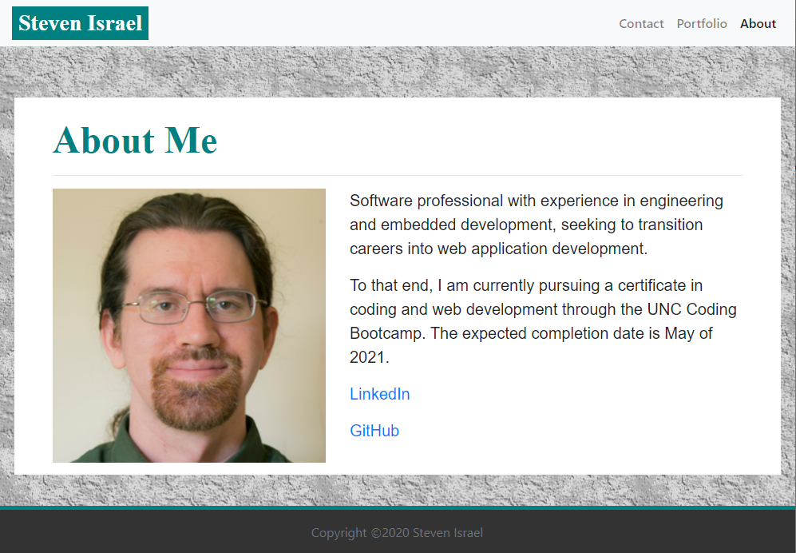

# malenchite.github.io
A personal website containing About, Portfolio, and Contact pages. It makes use of the Bootstrap framework for responsive design. This includes practice in responsive navigation, Bootstrap grid system, and a sticky footer.

## Screenshot

## Deployment
The website has been deployed as http://malenchite.github.io

## Credits
Basic page layout was provided as part of a UNC Coding Bootcamp assignment.  
Background texture courtesy of https://background-tiles.com/  
Bootstrap framework courtesy of https://getbootstrap.com/